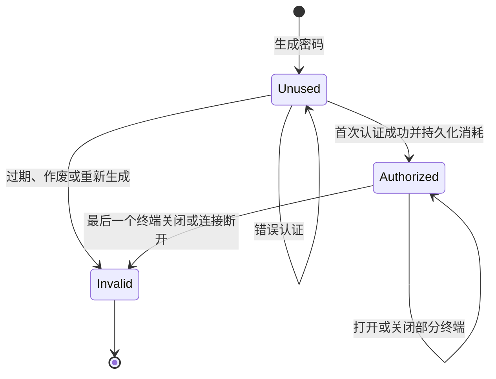

# 架构与信任边界

```mermaid
flowchart LR
    C[主控 Mac 客户端] -->|WebSocket / WSS| R[自托管中继 rc-server]
    A[被控设备 rc-agent] -->|WebSocket / WSS| R
    A --> P[系统用户权限下的 PTY]
    C -. 端到端 TLS 1.3 .-> A
    C --> L[本地项目与本地 PTY]
    C -->|独立 SSH 连接| S[SSH 服务器]
```

Agent 主动接入中继，客户端通过中继寻找已知设备 ID。中继转发端到端 TLS 字节流。SSH 与本地终端独立于这条路径。

| 模块 | 职责 |
| --- | --- |
| `rc-core` | 有界帧编码、解码与消息类型 |
| `rc-access` | 设备凭据、TLS、访问客户端及认证状态 |
| `rc-server` | 挑战签名注册、路由归属、加密数据转发 |
| `rc-agent` | 验证设备凭据，在系统用户权限下创建和管理 PTY |
| Tauri 后端 | 原生文件选择、证书读取、连接复用、终端 IPC |
| WebView | 项目与主机交互、终端显示、临时密码输入 |

设备初始化时生成 CA、设备服务证书及当前访问证书。设备 ID 为设备 CA DER 内容的 SHA-256 摘要，带 `rc-` 前缀。中继要求设备对随机挑战和注册信息签名，客户端在 TLS 握手中校验预期设备身份。

长期访问要求客户端完成 TLS 证书认证，且访问证书仍是设备当前允许的版本。临时访问在已验证设备身份的 TLS 内提交软件生成的高熵密码；设备端先原子地持久化消耗状态，再允许打开终端。



已使用状态保存在设备端，重启不会重新激活密码。多个终端共享同一次认证访问，不能用已使用密码创建第二条独立访问连接。

中继能观察设备 ID、连接时序及流量大小，也能中断服务；不能读取内层 TLS 保护的密码及终端数据。公网外层 WSS 使用系统信任的中继证书，内层 TLS 独立校验设备身份。

当前没有账号服务、P2P、远程桌面、会话录像或终端任务断线保活。帧、队列、心跳、证书生命周期及异常约束见 [安全说明](../SECURITY.md) 和 [协议说明](../protocol/UniRC-T-v2.md)。
